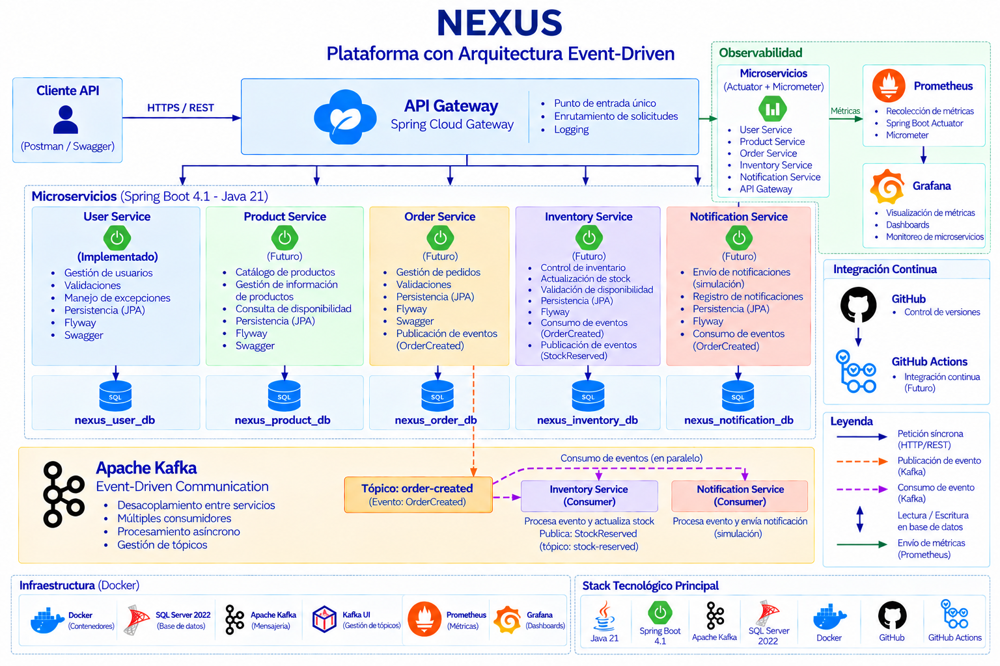

<p align="center">
<b>Nexus</b>
</p>

<p align="center">
<b>Event-Driven Architecture Platform</b>
</p>

<p align="center">
Java 21 • Spring Boot 4.1 • Apache Kafka • SQL Server 2022 • Docker
</p>

---

Nexus is an event-driven microservices platform designed to demonstrate modern backend architecture using **Java 21**, **Spring Boot 4.1**, **Apache Kafka**, **SQL Server**, and **Docker**.

The project focuses on microservices, asynchronous communication, **Database-per-Service**, REST APIs, and observability.

---

# Project Status

| Component | Status |
|---|---|
| Architecture | ✅ Defined |
| Docker + SQL Server | ✅ Completed |
| User Service | ✅ Completed |
| CRUD + Validation | ✅ Completed |
| Exception Handling + API Responses | ✅ Completed |
| Flyway | ✅ Completed |
| Swagger / OpenAPI | ✅ Completed |
| Product Service | 📋 Planned |
| Order Service | 📋 Planned |
| Inventory Service | 📋 Planned |
| Notification Service | 📋 Planned |
| Spring Cloud Gateway | 📋 Planned |
| Apache Kafka | 📋 Planned |
| Observability | 📋 Planned |
| GitHub Actions | 📋 Planned |

---

# Technology Stack

- **Backend:** Java 21, Spring Boot 4.1
- **Architecture:** Microservices, Event-Driven Architecture
- **Gateway:** Spring Cloud Gateway
- **Messaging:** Apache Kafka
- **API:** REST / JSON
- **Persistence:** Spring Data JPA / Hibernate
- **Database:** SQL Server 2022
- **Database Migrations:** Flyway
- **API Documentation:** OpenAPI / Swagger
- **Observability:** Actuator, Micrometer, Prometheus, Grafana
- **Infrastructure:** Docker / Docker Compose
- **Testing:** JUnit / Mockito
- **Version Control:** Git / GitHub
- **CI:** GitHub Actions

---

# Architecture

<p align="center">

</p>

Nexus is designed around independent microservices following the **Database-per-Service** pattern.

Main business services:

- User Service
- Product Service
- Order Service
- Inventory Service
- Notification Service

**Spring Cloud Gateway** will provide the main API entry point, while **Apache Kafka** will enable asynchronous communication between services.

---

# Current Implementation

The first implemented component is the **User Service**.

Current capabilities:

- User CRUD
- Request validation
- Duplicate email validation
- Global exception handling
- Standardized API responses
- SQL Server persistence
- Flyway database migrations
- Swagger / OpenAPI documentation

Database:

```text
nexus_user_db
```

---

# Infrastructure

Nexus currently uses Docker to provide the SQL Server infrastructure.

```text
NEXUS

└── Infrastructure
    └── SQL Server
        └── nexus_user_db
```

Infrastructure configuration:

```text
infrastructure/

├── .env.example
├── docker-compose.yml
└── sqlserver/
    └── init/
        └── 01-create-databases.sql
```

Additional infrastructure components such as Kafka, Kafka UI, Prometheus, and Grafana will be incorporated as the project evolves.

---

# Getting Started

## 1. Clone the repository

```bash
git clone https://github.com/esteban-navarro/nexus-microservices-kafka.git
cd nexus-microservices-kafka
```

## 2. Start SQL Server

From the `infrastructure` directory:

```bash
cd infrastructure
docker compose up -d
```

## 3. Create the database

Execute the following script using SQL Server Management Studio:

```text
infrastructure/sqlserver/init/01-create-databases.sql
```

This creates:

```text
nexus_user_db
```

## 4. Configure User Service

Copy:

```text
services/user-service/src/main/resources/application-local.example.yml
```

to:

```text
services/user-service/src/main/resources/application-local.yml
```

Configure your local SQL Server credentials.

## 5. Run User Service

From the `services/user-service` directory:

### Windows

```powershell
.\mvnw.cmd spring-boot:run
```

API:

```text
http://localhost:8080
```

Swagger UI:

```text
http://localhost:8080/swagger-ui.html
```

---

# Repository Structure

```text
nexus-microservices-kafka/

├── docs/
│   └── images/
│       └── architecture.png
│
├── infrastructure/
│   ├── .env.example
│   ├── docker-compose.yml
│   └── sqlserver/
│       └── init/
│
├── services/
│   └── user-service/
│
└── README.md
```

---

# Roadmap

### Microservices

- [x] User Service
- [ ] Product Service
- [ ] Order Service
- [ ] Inventory Service
- [ ] Notification Service
- [ ] Spring Cloud Gateway

### Event-Driven Architecture

- [ ] Apache Kafka
- [ ] `OrderCreated`
- [ ] `StockReserved`
- [ ] Event processing

### Observability

- [ ] Actuator / Micrometer
- [ ] Prometheus
- [ ] Grafana
- [ ] Kafka UI

### CI

- [ ] GitHub Actions
- [ ] Automated build
- [ ] Automated tests

---

# Development Practices

- Microservices Architecture
- Event-Driven Architecture
- Database-per-Service
- REST API Design
- DTO-based API Design
- SOLID Principles
- Clean Code
- Automated Testing
- Flyway Database Versioning
- Git Flow
